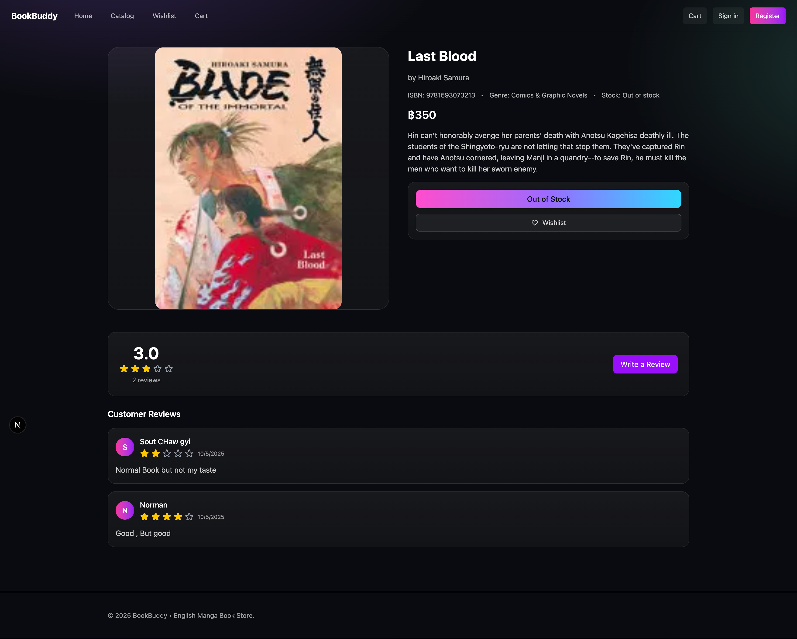

# BookBuddy — English Manga Store

> Web app to browse, search, and buy English manga.

## Team Members

- Aung Kaung Myat ([@Norman7781](https://github.com/Norman7781)) — [Repo](https://github.com/Norman7781/Book_Buddy)
- Wai Yan Mya Thaung ([@yano49](https://github.com/yano49)) — [Repo](https://github.com/yano49/yano49.github.io.git)
- Nyi Thu Hein ([@zenn404](https://github.com/zenn404)) - [Repo](https://github.com/zenn404/zenn404.github.io.git)

## Project Description

BookBuddy is a Next.js app where users can explore a manga catalog, search by title/author/genre, view book details from a database, and add items to a cart/wishlist.

### ✨ Key Features

- 📚 **Catalog & Detail Pages** — Explore manga titles, view covers, authors, descriptions, and categories.
- 🔍 **Search Functionality** — Quickly find manga by title, author, or genre using a smart search bar.
- 💖 **Wishlist System** — Save favorite manga for later and manage your personalized reading list.
- 🛒 **Cart & Buying Process** — Add manga to cart, review your selections, and simulate the checkout process with order summary and total calculation.
- 🔐 **User Authentication** — Simple login/register flow
- 🎨 **Modern UI Design** — Responsive dark theme built with TailwindCSS and gradient accents.
- ☁️ **Database-Backed** — Fetches and displays manga data dynamically from the MangaDB API.

## Tech Stack

**Home**

**Catalog (Search Results)**

**Book Detail**

**Cart**

## 🔗 Live Demo

Check out the deployed project here:  
👉 [Website deployed on Azure VM](http://wad-6611201.eastasia.cloudapp.azure.com:3001/bookbuddy)
